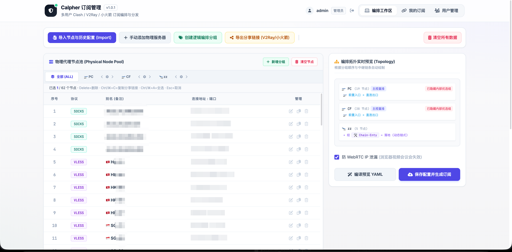

# Calpher 订阅管理

> 基于 Cloudflare Workers + KV 的多用户 Clash / V2Ray / 小火箭 订阅编排与分发平台。
> **仅供学习与个人研究使用。** 详见底部 [免责声明](#免责声明)。

[](docs/README.md)



## 功能

- **UUID 登录** —— 每个用户用一枚 UUID 作为身份，无密码
- **超级管理员** —— 由环境变量 `ADMIN_UUID` 初始化，可创建/删除其他用户、查看修改任何用户的配置
- **UUID 生成器** —— 创建用户时一键生成 v4 UUID
- **节点编排** —— 物理节点 / 逻辑分组 / 入口·出口·主控总线 / 链路（relay）的多层编排
- **订阅分发**
    - `Clash / Mihomo` —— 完整 yaml，聚合编排策略，内置 WebRTC 防泄漏等加固项
    - `V2Ray / 小火箭` —— 聚合 base64 订阅 + 按组拆分订阅
    - 订阅 token 与登录 UUID 分离，可一键重置作废旧链接
- **外部 API** —— 通过 `Authorization: Bearer <UUID>` 拉取/更新订阅，节点按指纹自动去重，适合接入外部脚本

## 文档导航

详细学习文档在 [`docs/`](docs/README.md) 目录，按"业务"和"框架"两条主线组织：

- **业务**（实现 / 设计思路）：[业务总览](docs/business/01-overview.md) · [KV 数据模型](docs/business/02-data-model.md) · [鉴权设计](docs/business/03-auth-design.md) · [节点编排](docs/business/04-node-topology.md) · [订阅格式](docs/business/05-subscription-formats.md) · [节点去重](docs/business/06-dedup.md) · [WebRTC 防泄漏](docs/business/07-webrtc-hardening.md)
- **框架**（Cloudflare Workers 平台知识）：[Workers 简介](docs/framework/01-cf-worker-intro.md) · [项目初始化](docs/framework/02-project-setup.md) · [KV 存储](docs/framework/03-kv-storage.md) · [Secret 与变量](docs/framework/04-secrets-and-vars.md) · [部署](docs/framework/05-deploy.md) · [静态资源打包](docs/framework/06-static-bundling.md) · [其他存储与服务](docs/framework/07-other-storage.md)

## 部署

### 1. 安装依赖

```bash
cd calpher-sub
npm install
```

### 2. 复制 wrangler 配置模板

`wrangler.toml` 含本地账号绑定的 KV namespace id，不进 git。clone 后第一步:

```bash
cp wrangler.toml.example wrangler.toml
```

### 3. 创建 KV 命名空间

```bash
npx wrangler kv namespace create CALPHER_KV
npx wrangler kv namespace create CALPHER_KV --preview
```

把返回的 `id` / `preview_id` 写入 `wrangler.toml` 的 `[[kv_namespaces]]` 段（替换掉占位的 `<your-namespace-id>` / `<your-preview-id>`）。

### 4. 设置初始管理员 UUID

生产环境用 secret（更安全）：

```bash
npx wrangler secret put ADMIN_UUID
# 粘贴一枚 v4 UUID, 例如 uuidgen | tr 'A-Z' 'a-z' 生成
```

本地开发用 `.dev.vars`：

```bash
cp .dev.vars.example .dev.vars
# 编辑里面的 ADMIN_UUID
```

### 5. 本地开发 / 部署

```bash
npm run dev      # 本地 http://127.0.0.1:8787
npm run deploy   # 部署到 Cloudflare
```

完整流程与常见问题排查见 [部署文档](docs/framework/05-deploy.md)。

## 路由

| 方法 | 路径 | 说明 |
| --- | --- | --- |
| GET | `/` | 主页面 |
| POST | `/api/auth/login` | `{uuid}` -> 建立 session cookie |
| POST | `/api/auth/logout` | 退出登录 |
| GET | `/api/me` | 当前用户信息 |
| GET | `/api/config?uuid=...` | 取配置（默认自己；admin 可查他人） |
| PUT | `/api/config?uuid=...` | 保存配置（body: `{config:{nodes,groups,busNames,compiledYaml}}`) |
| POST | `/api/subscription/rotate?uuid=...` | 重置订阅 token |
| GET | `/api/users` | 用户列表（仅 admin） |
| POST | `/api/users` | 新建用户 `{name,uuid,role}`（仅 admin） |
| DELETE | `/api/users/<uuid>` | 删除用户（仅 admin，不能删自己） |
| GET | `/api/v1/config` | 外部 API，需 `Authorization: Bearer <UUID>` |
| PUT | `/api/v1/config` | 同上 |
| GET | `/api/v1/subscriptions` | 取自己当前订阅链接列表 |
| GET/POST/PUT/DELETE | `/api/v1/nodes[/<id>]` | 节点细粒度 CRUD |
| GET/POST/PUT/DELETE | `/api/v1/groups[/<id>]` | 分组细粒度 CRUD |
| POST/DELETE | `/api/v1/groups/<gid>/nodes/<nid>` | 分组成员维度 |
| GET | `/sub/<token>/clash` | 公开 Clash yaml |
| GET | `/sub/<token>/v2ray` | 公开 v2ray/小火箭 聚合 base64 |
| GET | `/sub/<token>/group/<groupId>` | 单组 v2ray/小火箭 订阅 |

## 外部 API 示例

```bash
UUID=your-uuid-here
BASE=https://calpher-sub.your-account.workers.dev

# 拉自己的配置
curl -H "Authorization: Bearer $UUID" $BASE/api/v1/config

# 取订阅 URL 列表
curl -H "Authorization: Bearer $UUID" $BASE/api/v1/subscriptions

# 推一个新节点 (按指纹自动去重)
curl -X POST -H "Authorization: Bearer $UUID" -H "Content-Type: application/json" \
  -d '{"type":"socks","name":"test","server":"1.2.3.4","port":1080,"user":"u","pass":"p","groupIds":["g-zz"]}' \
  $BASE/api/v1/nodes

# 更新节点 + busNames (不带 compiledYaml -- clash 订阅会保留上一次浏览器编译版本)
curl -X PUT -H "Authorization: Bearer $UUID" -H "Content-Type: application/json" \
  -d '{"config":{"nodes":[...],"groups":[...],"busNames":{...}}}' \
  $BASE/api/v1/config
```

> 外部脚本如果想让 Clash 订阅也同步更新，需自己生成 `compiledYaml` 一并提交。原因：Clash 编排策略很复杂，
> Worker 内部只复用了简单的 v2ray uri 序列化逻辑，完整 mihomo yaml 编译只在浏览器端实现。详见 [订阅格式](docs/business/05-subscription-formats.md)。

## 存储模型 (KV)

| Key | Value |
| --- | --- |
| `user:<uuid>` | `{uuid, name, role, createdAt, subToken?}` |
| `config:<uuid>` | `{nodes, groups, busNames, compiledYaml, updatedAt}` |
| `subtoken:<token>` | `uuid`（反查所有者） |
| `session:<sid>` | `uuid`（30 天 TTL，登录态） |

详细字段说明见 [KV 数据模型](docs/business/02-data-model.md)。

## 安全注意

- 所有订阅 URL 都是带 token 的明文链接，任何持有者都能拉取你的代理节点。请妥善保管，泄露时点"重置 token"。
- UUID 同时是登录凭证，外泄等于失去账号 —— 管理员应及时创建新 UUID 并删除旧用户。
- 平台没有内置 HTTPS，部署到 workers.dev 或绑定自定义域后由 CF 提供 TLS。

## 免责声明

本项目（`calpher-sub`）是一个**纯前端 / 后端的配置编排器**，作用是把用户**自己已经拥有的**代理节点信息组织起来、生成符合 Clash / V2Ray 等客户端规范的订阅文件。

- 本项目**不提供、不分发任何代理节点、机场账号或翻墙服务**。
- 本项目**不实现任何具体的代理协议**，仅做配置文件的序列化与去重。
- 本项目**仅供学习计算机网络、Cloudflare Workers 平台、Web 应用开发等技术原理使用**。

使用者应当：

1. 遵守**所在国家、地区的法律法规**。在中华人民共和国境内使用本项目时，您应当确保使用方式符合《中华人民共和国网络安全法》及相关法规——即仅在**符合规定的科研、教育、技术学习等用途**下进行。
2. 自行承担因使用、修改、分发本项目而产生的全部法律责任。
3. 不得将本项目用于**任何商业、营利、非法翻越国家防火墙**或其他违反所在地法律法规的用途。

本项目作者**不对使用者的任何使用行为承担法律责任**，本项目按 "AS IS" 提供，不附带任何明示或暗示的担保。下载、克隆或运行本项目代码即视为您**已阅读、理解并同意**本免责声明的全部条款。如不同意，请立即停止使用并删除全部相关文件。

## License

本项目以学习交流为目的开源，参考使用请注明出处。
